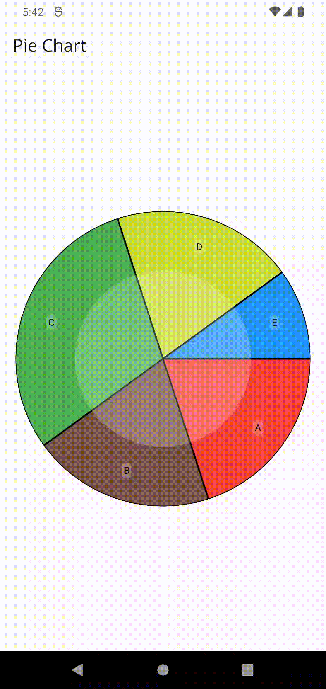

Your Custom Graph Package provides a flexible and easy-to-use solution for incorporating
customizable graphs into Flutter applications. Whether you need to display line charts, bar charts,
or any other custom graph, this package has you covered.

## Example

## Features

Versatility: Support for various graph types, including line charts, bar charts, and more.

Customization: Extensive customization options for colors, labels, axes, and more.

Interactivity: Interactive features such as touch gestures and tooltips for an engaging user
experience.

## Platform Support

Android: Supported
iOS: Supported
Web: Supported
Desktop (Windows, macOS, Linux): Supported

## Usage

Getting started with Your Custom Graph Package is straightforward. Here's a basic example:

    import 'package:custom_graph/custom_graph.dart';
    import 'package:custom_graph/models/data_model.dart';
    import 'package:flutter/material.dart';

    class GraphScreen extends StatefulWidget {
    const GraphScreen({super.key});

    @override
    State<GraphScreen> createState() => _GraphScreenState();
    }

    class _GraphScreenState extends State<GraphScreen> {

    final List<DataModel> dataSet = [
    DataModel(0.20, 'A', Colors.red),
    DataModel(0.20, 'B', Colors.brown),
    DataModel(0.30, 'C', Colors.green),
    DataModel(0.20, 'D', Colors.lime),
    DataModel(0.10, 'E', Colors.blue),
    ];

    @override
    Widget build(BuildContext context) {

        return PieChart(dataSet: dataSet);
    
    }
    }

## Options and Customization

Your Custom Graph Package offers a wide range of customization options. Here are some key features:

Graph Types: Choose from line charts, bar charts, pie charts, etc.
Color Schemes: Customize colors for data points, background, and more.
Labels and Legends: Control the display of labels and legends.
Axis Configuration: Adjust the appearance and behavior of the graph axes.
For a comprehensive guide on customization, refer to the Customization Documentation.

## Documentation

Visit the official documentation for in-depth information on installation, usage, customization, and
more.
